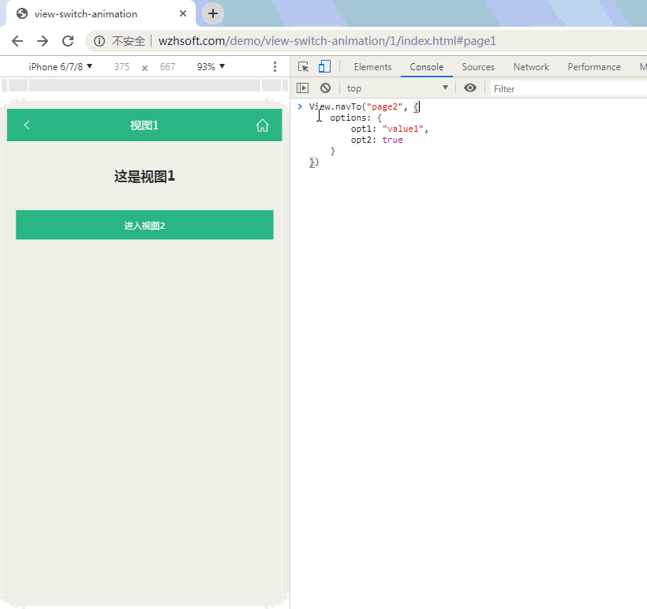

# 活动视图

## 概述

活动视图，是指当前处于活动状态、被用户看到的视图。

任何情况下，最多只有一个视图处于活动状态。开发者可以通过API：`View.getActiveView()` 获取当前的活动视图，如下所示：



```javascript
/* 导航到ID为 view1 的视图 */
View.navTo("view1");
console.log(View.getActiveView().getId());// --> view1

/* 导航到ID为 view2 的视图 */
View.navTo("view2");
console.log(View.getActiveView().getId());// --> view2
```



也可以使用借助API：`view.isActive()` 判定特定视图是否处于活动状态：

```javascript
/* 导航到ID为 view2 的视图 */
View.navTo("view2");
console.log(View.getActiveView().getId());// --> view2

console.log(View.ofId("view1").isActive());// --> false
console.log(View.ofId("view2").isActive());// --> true
```

## 视图选项

视图选项，是体现在浏览器地址栏中，位于视图信息后边的参数集合。（View.js 不仅支持 视图选项，还支持 视图参数，我们将在后边的篇章中详细介绍这两者。）

活动视图的视图选项，可通过API：`View.getActiveViewOptions()` 及 `View.getActiveViewOption(optionName)` 获取。例如：

```javascript
// URL: http://view-js.com/#main!a=1&b=2

/**
 * 获取所有选项。如果一个选项也没有，则返回 null
 */
console.log(View.getActiveViewOptions()); // --> {a: "1", b: "true"}

/**
 * 获取 key 为 'a' 的选项取值
 */
console.log(View.getActiveViewOption("a")); // --> "1"

/**
 * key 为 'c' 的选项不存在，返回 undefined
 */
console.log(View.getActiveViewOption("c")); // --> undefined
```

技术上，由于 视图选项 仍然属于锚点的内部内容，所以当视图发生切换时，视图选项 将和 视图 同时出现和隐藏。 而`View.getActiveViewOptions()` 和 `View.getActiveViewOption(optionName)` 也将只返回最新的活动视图的视图选项，如下图所示：



亦即，当视图没有处于活动状态时，开发者是无法获得该视图的视图选项的。

如果需要随时能够获取响应参数，则可以在视图进入时，将视图选项存放到视图的上下文中，如下所示：

```javascript
var view = View.ofId("my-view");

/**
 * 添加 “视图进入” 事件监听。
 * 'enter' 为 View.js 预置的，代表 ‘视图进入’ 的事件名称。
 */
view.on("enter", function(){
  var options = View.getActiveViewOptions();

  /**
   * 每个视图实例均预置有 context - 视图数据存取上下文，
   * 可用于在视图内部存取数据。常用方法有：
   * set(name, value) - 存放数据
   * get(name) - 获取数据
   * has(name) - 判断是否含有数据
   */
  view.context.set("options", options);

  //...

  console.log(options === view.context.get("options")); // --> true
});
```