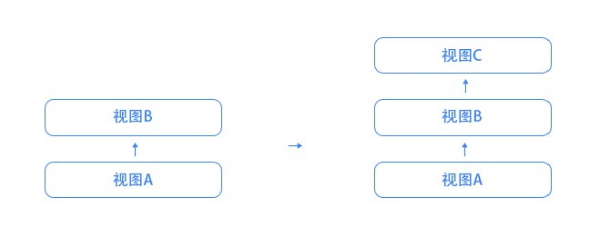
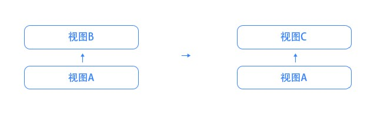

# 视图跳转（一）

## 概述

视图跳转，是指活动视图由一个视图转变为另外一个视图的过程。

开发者通过如下两种方式执行视图跳转：

1. 在 DOM 元素上声明跳转指令：`data-view-rel`
2. 在 js 中调用API：`View.navTo(targetViewId)` 或 `View.changeTo(targetViewId)`

例如：



```html
<!-- :back 为伪视图，代表上一个视图 -->
<a class = "nav-back" data-view-rel = ":back">返回</a>
<!-- :default-view 为伪视图，代表默认视图 -->
<a class = "nav-home" data-view-rel = ":default-view">首页</a>

<!-- 跳转至 order 命名空间下ID为 settle-order 的视图，并使用视图选项传递参数：orderId -->
<div class = "btn" data-view-rel = "settle-order@order!orderId=ORD01">结算</div>
```



```javascript
/* 跳转至 default 命名空间下的 targetViewId */
View.navTo("targetViewId");

/* 跳转至 targetViewNamespace 命名空间下的 targetViewId */
View.navTo("targetViewId", "targetViewNamespace");

/* 跳转至 targetViewNamespace 命名空间下的 targetViewId，并传递 视图参数（关键字：params） 和 视图选项（options） */
View.navTo("targetViewId", "targetViewNamespace", {
    params: {/* 'params' 为预留关键字，代表视图参数。视图参数可以传递任意类型的参数，但刷新后丢失 */
        param1: "paramValue",
        param2: {
            key: "value"
        },
        param3: document.body,
        callback: function(){}
    },

    options: {/* 'options' 为预留关键字，代表视图选项。视图选项只能传递字符串类型的参数，刷新后不会丢失 */
        option1: "optionValue"
    }
})
```



## 底层技术

View.js 使用浏览器的 `history` API完成视图跳转。

`history.pushState()` 方法使能 `View.navTo()` 方法 和 `data-view-rel-type` 的 `nav` 取值；`history.replaceState()` 方法使能 `View.changeTo()` 方法 和 `data-view-rel-type` 的 `change` 取值。

> `data-view-rel` 指令用于指定跳转目标；`data-view-rel-type = nav | change` 用于指定视图的跳转方式：压入堆栈（`nav`） 或 替换栈顶（`change`）。
>
> `View.navTo()` 用于以“压入堆栈”的方式执行视图跳转；`View.changeTo()` 用于以“替换栈顶”的方式执行视图跳转
>
> “压入堆栈” 和 “替换栈顶” 的差别，在于如何影响用户的浏览位置。


堆栈或栈顶的变化，直接决定了页面的返回路径，因而需要开发者格外注意，否则很容易会让终端用户掉入无法返回的陷阱中。换句话讲，开发者需要设计清晰、合理的浏览路径，选择合适的跳转方法，尽可能地让页面之间的跳转表现符合用户的预期。


### 压入堆栈

压入堆栈式浏览，是指保留用户的当前浏览位置，将下一个浏览位置追加到浏览队列中，使得用户可以返回到之前的浏览位置上去的浏览方式。

例如，对于浏览历史 A → B，当从活动视图 B 以 “压入堆栈方式” 切换到 C 后，用户需要执行两次回退操作，才能返回视图A：




### 替换栈顶

替换栈顶式浏览，是指使用下一个浏览位置替换当前的浏览位置，使得用户无法返回到之前的浏览位置上去的浏览方式。

例如，对于浏览历史 A → B，当从活动视图 B 以 “替换栈顶方式” 切换到 C 后，用户执行一次回退操作就可以返回视图A，而无法再返回到视图B：


