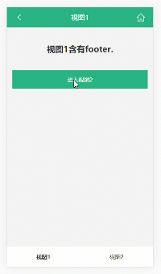

# 视图容器

## 概述

视图容器，即为存放所有视图骨架的 DOM 容器。除非明确指定，否则 View.js 默认将 `document.body` 视为视图容器。

视图容器的作用，主要是为了限定视图的渲染范围、视觉位置，统一约束视图的外围轮廓等。通过调整视图容器的尺寸和位置，开发者可以实现不同的表现效果：




开发者可以借助浏览器的开发者工具，通过识别 `data-view-container` 属性确定当前的视图容器，例如：


也可以使用API得知：


## 状态表达

除了集中包裹视图之外，视图容器还承载着 “表达 View.js 的初始化状态，以及当前活动视图” 的责任。这些信息的表达，通过在其 DOM 上附加相关属性完成，例如：


其中 `data-view-state=ready` 表示 “View.js 已准备就绪”，`data-active-view-id` 代表当前活动视图的 ID，`data-active-view-namespace` 代表当前活动视图的命名空间。

## 其它控制

### 直接访问

开发者可以借助视图容器设定视图默认是否可以直接访问。

视图是否“可以直接访问”，是指视图在传播打开或刷新时，是否在页面装载完毕后第一个呈现给用户。

如果页面装载完毕后，用户看到的第一个视图不是被传播访问或刷新的视图，我们就说视图是“不能直接访问的”；反之，视图就是“可以直接访问的”。

开发者可以在视图容器的 DOM 结点上声明属性 `data-view-directly-accessible=true|false` 以设定“所有视图是否可以直接访问”，也可以在特定视图的骨架 DOM 结点上单独声明，以设定该视图的单独表现情况。例如：



```markup
<body>
  <!-- 设定所有视图默认可以直接访问 -->
  <div
    data-view-container
    data-view-directly-accessible = "true">
    
    <!-- 设置视图不能直接访问 -->
    <section
        data-view-id = "view1"
        data-view-directly-accessible = "false">
    </section>
    
    <!-- 设置视图可以直接访问 -->
    <section
        data-view-id = "view2"
        data-view-directly-accessible = "true">
    </section>
    
    <!-- 继承默认配置 -->
    <section data-view-id = "view3"></section>
    
  </div>
</body>
```



其中，`view1` 不能直接访问（响应自身配置），`view2` 可以直接访问（响应自身配置），`view3` 可以直接访问（响应全局配置）。

没有在视图容器上声明 `data-view-directly-accessible` 属性时，View.js 默认将所有视图设定为“不能直接访问”。

### 渲染宽高比

视图容器支持 `data-view-whr` 属性，以允许开发者设定视图在 PC 的桌面环境浏览时，视图容器渲染尺寸的宽高比。

当用户在移动端浏览网页时，这一属性并无作用。但当浏览环境是 PC 这一 “宽度大于高度” 的情况时，View.js 将调整视图容器的渲染效果，使其 “高度撑满，宽度按比例动态计算，水平居中”，如下所示：


View.js 默认将其设定为 "320/568"，即为 iPhone5 的宽高比。开发者可以按需在视图容器上调整属性值：

```markup
<div data-view-container data-view-whr = "375/568">
    ...
</div>
```

其效果效果如下所示：


